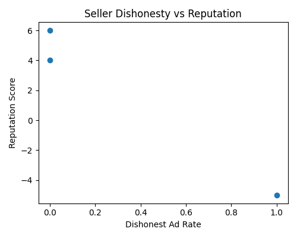
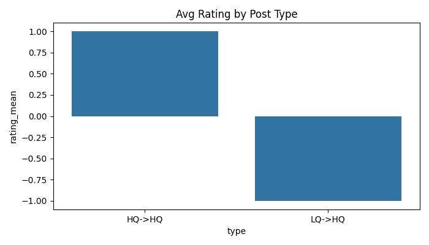
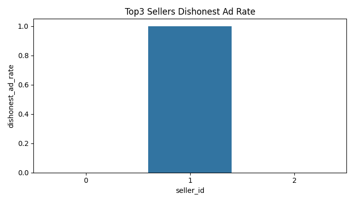
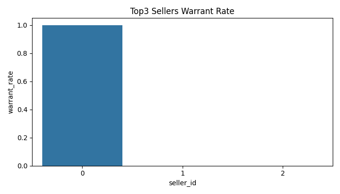
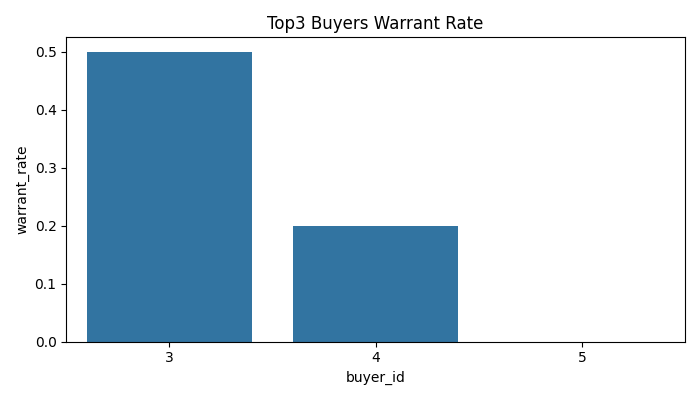

### RQe 报告（Easy RQs 概览）

本报告基于单次仿真生成的数据库（market_sim.db），统计与图像来自 `analysis_output_e/rqe`。程序回合与数据库回合已在生成脚本中处理为“程序回合（prog_round）”，但此处 RQe 指标均以整体样本计算为主。

### RQe1 卖家不诚实行为与最终 Reputation 的相关性

- 指标：
  - 卖家维度的不诚实广告率：`Dishonest Ad Rate = LQ→HQ 的listing数 / 全部listing数`
  - 交易维度的不诚实销售率：`Dishonest Sale Rate = (LQ→HQ 且售出) / 全部交易`
  - 卖家最终 `reputation_score`
- 结果表：`rqe1_seller_dishonesty_vs_reputation.csv`
- 结果图：
  - 
- 简评：
  - 观察散点可直观看出不诚实广告率与最终声誉之间的相关趋势；若点主要呈负相关方向，说明更高的不诚实对应更低的声誉（具体数值可在CSV中计算皮尔逊/斯皮尔曼相关）。

### RQe2 四类商品的评分统计

- 分组定义：
  - `LQ->LQ`, `LQ->HQ`, `HQ->HQ`, `HQ->LQ`
- 指标：每类的平均评分与标准差（若一个post多笔交易，则先对该post的rating均值，再在类型层面求均值）
- 结果表：`rqe2_post_type_rating_stats.csv`
- 结果图：
  - 
- 简评：
  - 通常预期 `HQ->HQ` 的评分最高，`LQ->HQ` 在被识别/反馈后评分偏低；标准差可反映该类在交易反馈上的稳定性。

### RQe3 顶部三个卖家的欺骗与担保情况

- 选取：按上架数量排序的前三卖家
- 指标：
  - 欺骗率（广告不诚实率）：`LQ->HQ` 上架占比
  - 上架担保率：`has_warrant` 的均值
  - 若存在交易：交易维度的欺骗销售率
- 结果表：`rqe3_top3_seller_deception_and_warrant.csv`
- 结果图：
  - 
  - 
- 简评：
  - 若某卖家担保率更高且欺骗率更低，通常与更好的市场反馈相关；对比三者可以定位出异常策略（高欺骗/低担保）。

### RQe4 顶部三个买家的评分与担保偏好

- 选取：按交易次数排序的前三买家
- 指标：
  - 评分均值/标准差
  - 其购买商品的担保率（`has_warrant` 均值）
- 结果表：`rqe4_top3_buyer_rating_and_warrant.csv`
- 结果图：
  - 
  - 
- 简评：
  - 若买家更偏好担保商品，可能导致其给出的评分更稳定或更高；也可对照卖家担保策略理解市场匹配。

### 复现与扩展

- 生成脚本：`visualization_sim_db_RQe.py`
- 输出目录：`analysis_output_e/rqe`
- 可扩展：
  - 在 RQe1 中进一步计算皮尔逊/斯皮尔曼相关并给出数值。
  - 对上述四个RQe按“程序回合”输出时间趋势图，观察动态变化。
  - 结合多次仿真结果进行稳健性检验（均值、置信区间、bootstrap）。
